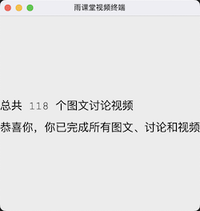

# 长江雨课堂视频、图文、讨论自动完成工具（为了应对非必要课程）

## 食用步骤：

### 1. 配置环境
    python3
    pip3 install -r requirements.txt

### 2. 执行脚本
    python3 main.py

### 3. 运行界面

#### 3.1 微信扫码登录

#### 3.2 登录后选择要进行的课程

#### 3.3 选择课程后，脚本会自动检索所有符合的视频、图文、讨论为它刚兴趣的课题，并自动进行完成

#### 3.4 完成所有任务后

### 4. 欢迎大家fork来更新更有趣的功能，谢谢